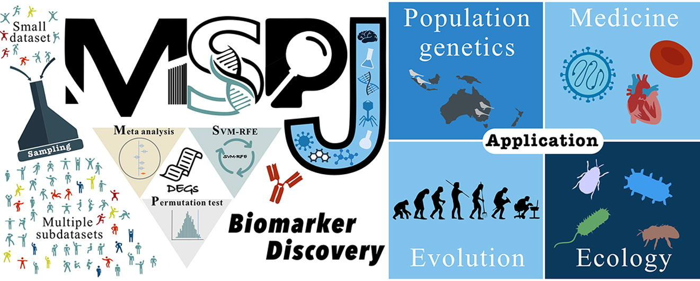

# MSPJ
**MSPJ**: discovering potential biomarkers in small gene expression datasets *via* ensemble learning

- Huachun Yin, Jingxin Tao, Bo Li, *et al.*

 

**Please Cite**: HuaChun Yin, JingXin Tao, Yuyang Peng, Ying Xiong, Bo Li, Song Li, Hui Yang. MSPJ: discovering potential biomarkers in small gene expression datasets *via* ensemble learning. ***Computational and Structural Biotechnology Journal***, 2022, DOI: [10.1016/j.csbj.2022.07.022](https://www.sciencedirect.com/science/article/pii/S2001037022003026)

PS: All artificial datasets used to evaluate the performance of gene selection methods were deposited in the Zenodo repository <https://doi.org/10.5281/zenodo.6320499>. The real datasets were collected from GEO and pre-processed according to the pipeline described in this manuscript. 
